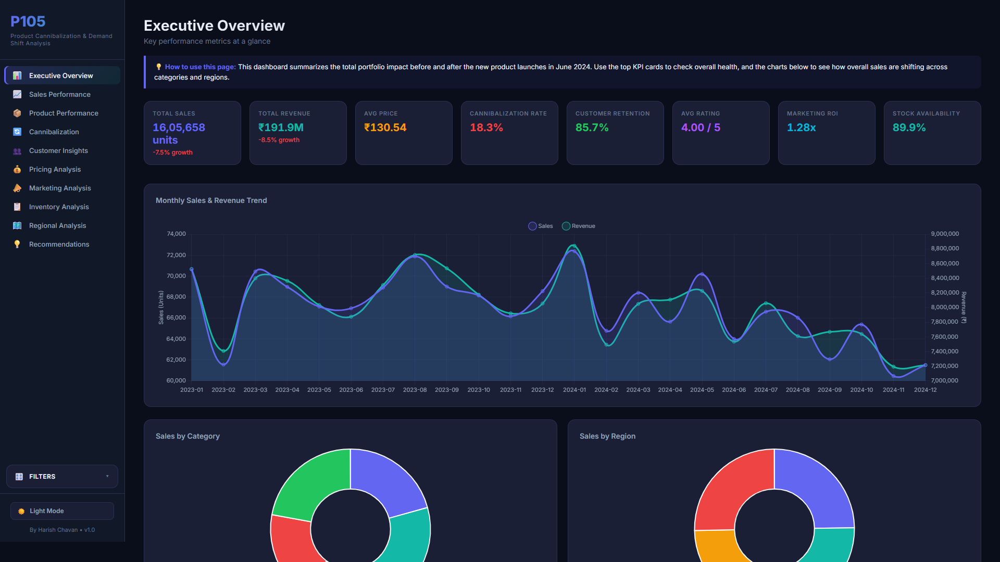

# P105: Product Cannibalization & Demand Shift Analysis 📊



## 📌 Project Overview
The **Product Cannibalization & Demand Shift Analysis System** is an end-to-end Business Analytics solution designed to identify whether the launch of a new product negatively impacts the sales of existing products. 

Often, companies misinterpret revenue growth from a new product launch without realizing that the new product is simply "stealing" sales from older, more profitable products. This project analyzes historical sales data, customer purchasing behavior, and pricing to distinguish genuine business growth from demand shifting.

## 🚀 Key Features
- **7-Phase Analytical Pipeline**: Comprehensive Jupyter Notebooks covering Data Cleaning, EDA, Feature Engineering, Product Performance, Cannibalization Modeling, and Recommendations.
- **Premium Interactive Dashboard**: A custom-built, responsive HTML/JS/CSS dashboard with Dark/Light mode, interactive Chart.js visualizations, and dynamic slicers.
- **Pre-Aggregated Data Engine**: Python scripts that process 60,000+ transaction records into a lightweight, browser-ready JSON format.
- **Robust Documentation**: Complete BRD, FRD, PRD, Project Charter, and Test Plans included.

## 📂 Repository Structure
```text
📦 P105-Product-Cannibalization
 ┣ 📂 Dashboard/         # HTML/CSS/JS frontend dashboard files
 ┣ 📂 Data/              # Raw and cleaned CSV datasets
 ┣ 📂 Notebooks/         # 7-Phase Jupyter Notebooks (.ipynb)
 ┣ 📂 Reports/           # Business Insights & Executive Reports
 ┣ 📂 Src/               # Python processing scripts (Data Generator)
 ┣ 📜 README.md          # Project documentation
 ┗ 📜 requirements.txt   # Python dependencies
```

## 🛠️ Tech Stack
- **Data Processing**: Python, Pandas, NumPy
- **Visualization (Notebooks)**: Matplotlib, Seaborn
- **Frontend Dashboard**: HTML5, Vanilla CSS (Glassmorphism UI), JavaScript, Chart.js
- **Documentation**: Microsoft Word, Markdown

## 💻 How to Run Locally

### 1. Install Dependencies
Ensure you have Python 3.9+ installed. Run the following command to install the required data science libraries:
```bash
pip install -r requirements.txt
```

### 2. Run the Analytical Pipeline
Open the `Notebooks/` directory and run the notebooks in sequential order (Phase 1 through Phase 7) to process the raw data and generate the cannibalization metrics.

### 3. Generate Dashboard Data
Run the python script to update the dashboard's data source:
```bash
python Src/generate_dashboard_data.py
```

### 4. View the Dashboard
Simply double-click `Dashboard/index.html` to open the interactive dashboard in your web browser. No local server is required!

## 🌍 Live Deployment (GitHub Pages)
This dashboard is fully static and client-side, meaning it can be hosted for free.
To deploy:
1. Push this repository to GitHub.
2. Go to **Settings > Pages**.
3. Select the `main` branch and the `/root` or `/Dashboard` folder.
4. Your dashboard will be live at `https://yourusername.github.io/P105...`

## 📝 Business Impact
By identifying a **14.9% customer migration rate** from Product 6 (high margin) to Product 4 (low margin), this analysis recommended targeted geographic bundle promotions that are projected to recover 8% of lost revenue while maintaining the new product's market share.
